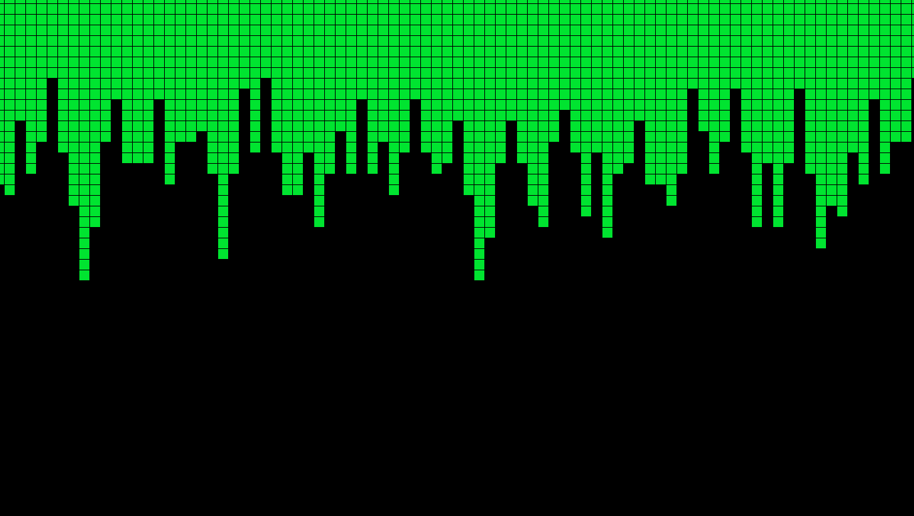
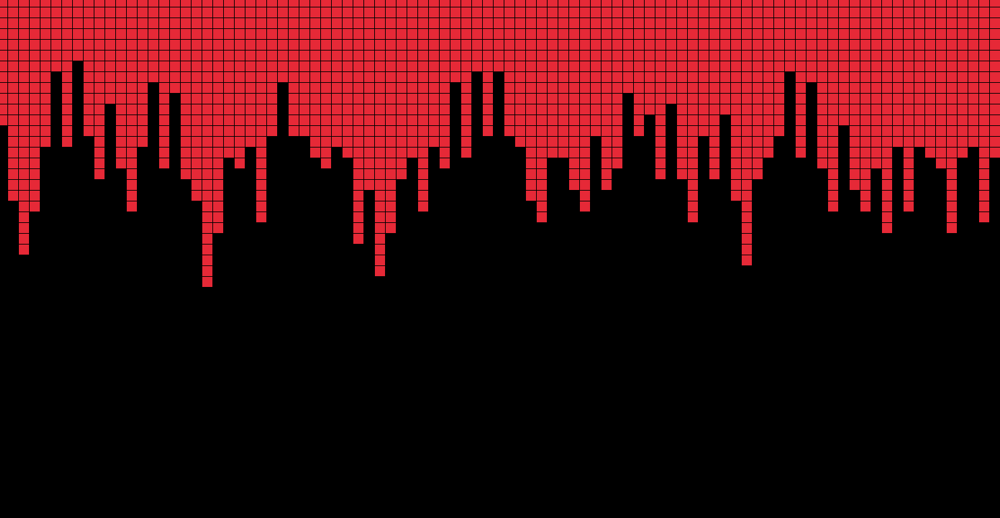

# scrolling_top_map_border
Random scrolling level map border used for example in a side-scrolling space shooter

An attempt at making an infinite scrolling top level border for use in a side-scrolling game. Unfortunately though it is infinite it is not seamless and future work is needed to make the change indistinguishable.

  

 

